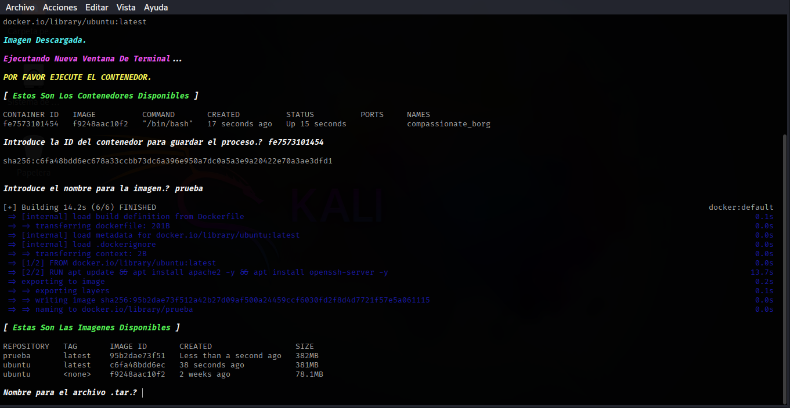
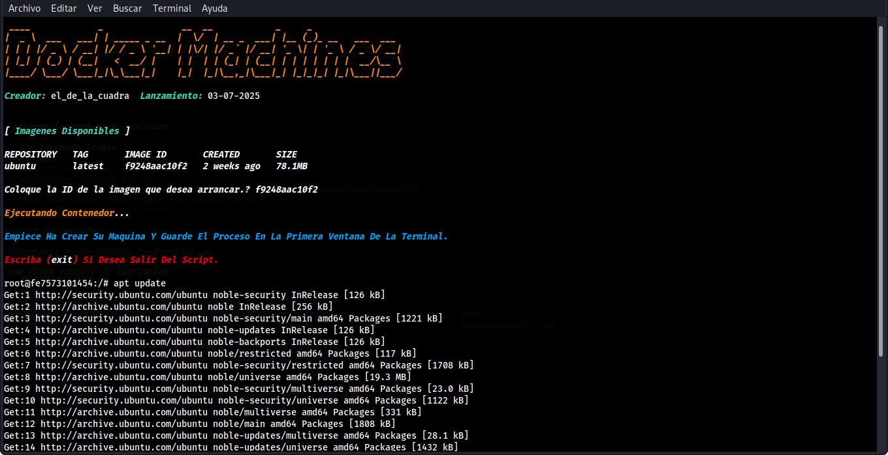
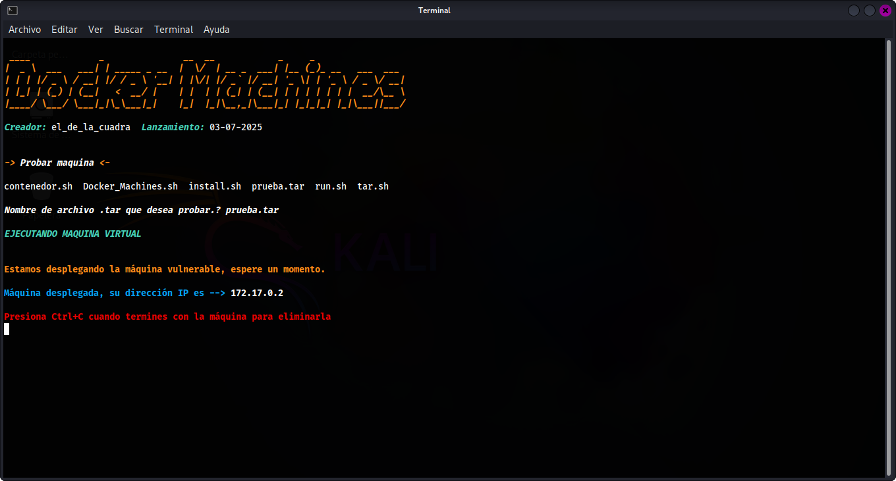

# Docker-Machines
Una sencilla herramienta en bash para crear maquinas virtuales para practicar hacking etico usando docker, imagen docker por defecto ubuntu:latest, Personalize la maquina virtual a su preferencia y ponga en practica sus habilidades.  

# Uso.
 1. Ejecutar herramienta.
 2. Presione (Enter) para empezar a descargar la imagen de docker.
 3. En la nueva ventana de la terminal coloque la id de la imagen para ejecutar el contenedor.
 4. Personalizar maquina virtual (segunda terminal) !no cerrar la ventana!
 5. Coloque la id del contenedor para actualizar la imagen 'guardar cambios' en la (ventana de terminal principal). 
 7. Despues de aguardar los cambios usa el comando 'exit' para cerrar el script (segunda ventana)
 8. Introduce el nombre de la imagen docker para pasarle un dockerfile (servicios siempre en ejecucion).
 9. Elija el nombre para el fichero final .tar (convertir imagen docker en formato .tar)
10. Nombre de la maquina virtual .tar para asegurarse de que se a creado correctamente. (probar maquina virtual creada).    
 
# Instalacion De La Herramienta.
Ejecuta una ventana de terminal y clone el repositorio [Docker-Machines](https://github.com/Eldelacuadra/Docker-Machines.git).

```sh
git clone https://github.com/Eldelacuadra/Docker-Machines.git
```
Asi como se muestra a continuacion.
<p align="center"></p>

Ingresar a la carpeta creada y visualizar los archivos.

```sh
cd Docker_Machines && ls
```
Estos serian los resultados.
<p align="center"></p>

Conceder permisos de ejecucion a todos archivos.

```sh
chmod +x install.sh tar.sh run.sh contenedor.sh Docker_Machines.sh
```
Si se ejecuto correctamente el comando estos serian los resultados. 
<p align="center"></p>

Instalar las dependencias.

```sh
sudo bash install.sh
```
<p align="center"></p>

Ejecutar la herramienta.

```sh
sudo bash Docker_Machines.sh
```
<p align="center"></p>
Y listo.

# Primera imagen.
Instalacion de la imagen docker. (script llamado Docker_Machines.sh)
<p align="center"></p>

# Segunda imagen.
Ejecucion del contenedor. (script llamado contenedor.sh)
<p align="center"></p>

# Tercera imagen.
Probando la maquina virtual. (script llamado tar.sh)
<p align="center"></p>


