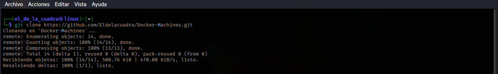
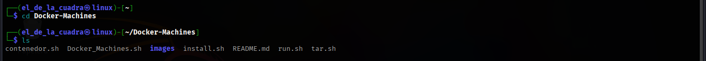
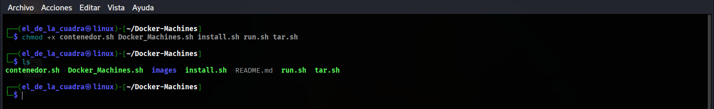
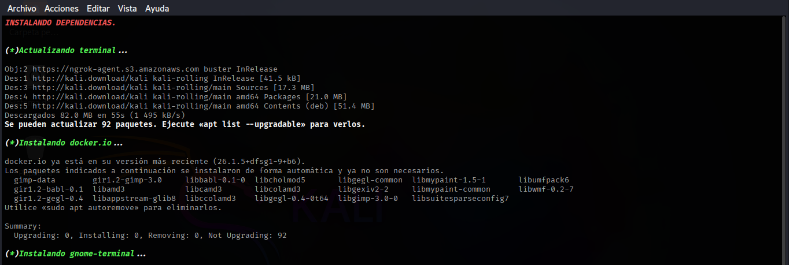
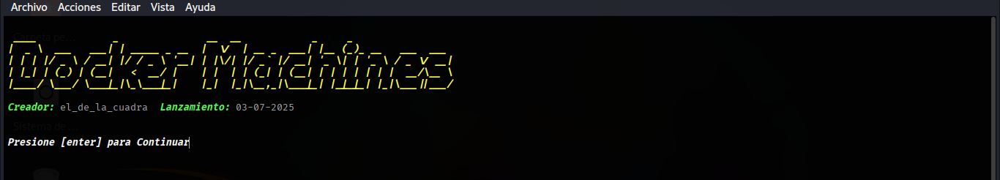

# Docker-Machines
Una sencilla herramienta para crear maquinas virtuales usando docker, imagen docker por defecto ubuntu:latest.
configure la maquina virtual ha su gusto.

# Instalacion De La Herramienta.
Ejecuta una ventana de terminal y clone el repositorio [Docker-Machines](https://github.com/Eldelacuadra/Docker-Machines.git).

```sh
git clone https://github.com/Eldelacuadra/Docker-Machines.git
```
Asi como se muestra a continuacion.
<p align="center"></p>

Ingresar a la carpeta creada y visualizar los archivos.

```sh
cd Docker_Machines && ls
```
Estos serian los resultados.
<p align="center"></p>

Conceder permisos de ejecucion a todos archivos.

```sh
chmod +x install.sh tar.sh run.sh contenedor.sh Docker_Machines.sh
```
Si se ejecuto correctamente el comando estos serian los resultados. 
<p align="center"></p>

Instalar las dependencias.

```sh
sudo bash install.sh
```
<p align="center"></p>

Por ultimo ejecute la herramienta y listo.

```sh
sudo bash Docker_Machines.sh
```
<p align="center"></p>


